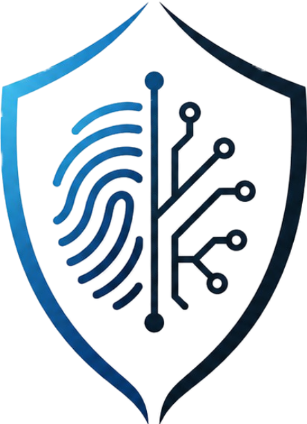

  

# Satya-Shield 🛡️
**A Real-Time Deepfake and Voice Clone Detection Engine**
Satya-Shield is a real-time, multimodal synthetic media detection system. This repository contains a working Minimum Viable Product (MVP) designed to extract mathematical acoustic features and spatial-temporal anomalies to identify AI-generated deepfakes and voice clones.

## 🚀 Features

*   **Multimodal Detection Pipeline:** Processes both audio and video inputs for comprehensive synthetic media detection.
*   **Heuristic Audio Firewall:** Analyzes audio files using spectral and temporal features to catch basic synthetic artifacts:
    *   **Spectral Centroid:** Detects high-frequency smoothing common in TTS generation.
    *   **Zero-Crossing Rate (ZCR):** Analyzes vocal cord friction anomalies.
    *   **MFCC Variance:** Identifies mechanical and robotic dynamic ranges.
*   **Neural Inference Engine:** Built-in ONNX runtime integration for deploying state-of-the-art Deep Learning models directly on the backend.
*   **Graceful Fallback Logic:** Automatically defaults to the heuristic firewall if neural weights are unavailable, ensuring zero downtime.

Unlike standard wrapper applications, Satya-Shield processes raw data using a custom Machine Learning feature extraction pipeline with a dynamic routing engine:

1. **Frontend Interface:** A highly responsive, dark-mode web dashboard built with Vite, React, and Tailwind CSS v4.
2. **Asynchronous Backend:** A lightweight FastAPI server designed for rapid file buffering and dynamic media routing.
3. **Acoustic Extraction Engine:** Utilizes `librosa` to break down audio waves into Mel-frequency cepstral coefficients (MFCCs) and analyze Spectral Centroids to detect the high-frequency smoothing characteristic of synthetic voices.
4. **Visual Variance Engine:** Utilizes `OpenCV` to deconstruct video containers frame-by-frame, calculating Laplacian edge variances to detect the micro-jitters and boundary blurring typical of generative face-swaps.

## 🚀 Recent Enhancements
- **Custom-Trained Inference:** Successfully migrated from generic base models to a custom-fine-tuned Wav2Vec2 architecture, optimized via ONNX Runtime for production-grade speed and precision.
- **Optimized Model Pipeline:** Implemented seamless cloud-to-local deployment using `optimum-cli` and `gdown`, ensuring efficient handling of complex neural weights.
- **Enhanced Forensic Dashboard:** Upgraded UI to visualize real-time acoustic fingerprints, including **MFCC spectral mapping** and **Chroma tonal pitch analysis**, providing transparent, explainable detection verdicts.

## 🛠️ Tech Stack
* **Frontend:** React.js, Tailwind CSS v4, Vite
* **Backend:** Python, FastAPI, Uvicorn
* **AI/Deep Learning:** PyTorch, Wav2Vec2, ONNX Runtime, Optimum
* **Audio/Signal Processing:** Librosa, NumPy

## 📊 Forensic Visualizations
*The dashboard provides an immediate breakdown of media authenticity, utilizing granular acoustic data to justify threat verdicts.*

*Figure 1: Real-time Forensic Dashboard*

*Figure 2: Acoustic MFCC & Chroma Tonal Mapping*

## ⚙️ Installation & Setup

### Backend
1. Navigate to the backend directory: `cd backend`
2. Activate the virtual environment: `source venv/bin/activate`
3. Install dependencies: `pip install -r requirements.txt`
4. Start the server: `uvicorn main:app --reload`

### Frontend
1. Navigate to the frontend directory: `cd frontend`
2. Install dependencies: `npm install`
3. Start the development server: `npm run dev`

## 🧠 Architecture Overview
Satya-Shield operates on a dual-layer security model. First, media is passed through a lightweight mathematical thresholding system (Librosa/OpenCV) for rapid artifact detection. Next, the pipeline routes the data to an ONNX-powered Deep Learning session for complex, non-linear pattern recognition, successfully countering advanced generative models.